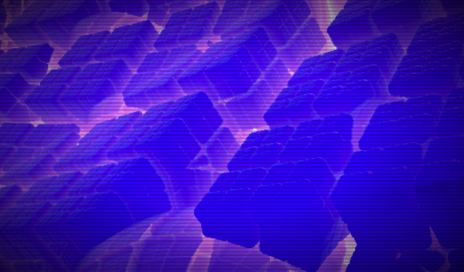
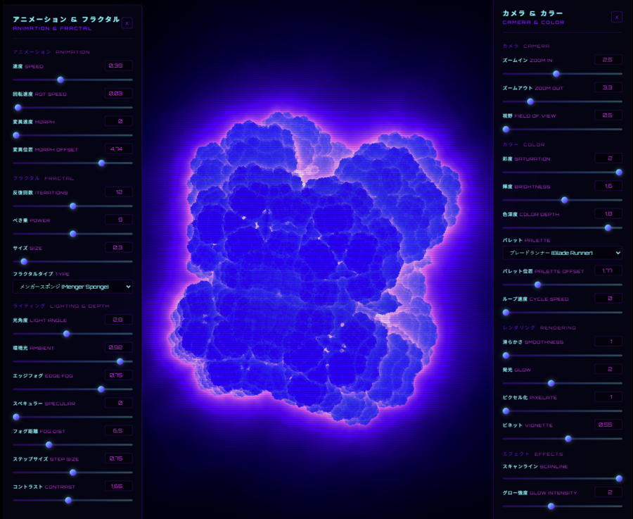

# fractal37

  

  **fractal37** is an interactive 3D fractal explorer rendered entirely in WebGL — embedded in a single HTML file (and also available as a full React web app). Fly through mathematically infinite structures with real-time controls for animation, lighting, color, and rendering style.

  ## Live Demo

  [View on Replit →](https://replit.com) &nbsp;·&nbsp; [Open standalone explorer →](index.html) &nbsp;·&nbsp; [Frontpage →](frontpage.html)

  ---

  ## Features

  ### 7 Fractal Types
  | Name | Description |
  |------|-------------|
  | **Mandelbulb** | The iconic 3D extension of the Mandelbrot set using spherical power iteration |
  | **Mandelbox** | Box- and sphere-fold IFS fractal with rich interior detail |
  | **Torus Knot** | Mathematically knotted tube sampled with angular SDF |
  | **Apollonian** | Inversion-based IFS gasket producing infinite circle packing |
  | **Julia 3D** | 4D quaternion Julia set sliced through 3D space |
  | **Sierpinski Tetra** | Classic IFS tetrahedral fractal — triangular self-similarity |
  | **Menger Sponge** | Cube-subtraction fractal with recursive cross-shaped holes |

  ### 9 Color Palettes
  Blade Runner · Cyber · Neon Trout · Heat · Frost · Monochrome · Neon Blue · Magenta Cyan · CGA Retro

  All palettes use Inigo Quilez's cosine-basis formula — mathematically seamless, zero banding.

  ### Real-Time Controls

  

  Press **C** or **tap/click** anywhere on the canvas to toggle the control panels.

  - **Animation** — speed, rotation speed, morph speed & offset
  - **Fractal** — iterations, power/exponent, size, type
  - **Lighting** — light angle, ambient, edge fog, specular, fog distance, step size, contrast
  - **Camera** — X/Y rotation, field of view
  - **Color** — saturation, brightness, color depth, palette, palette offset & cycle speed
  - **Rendering** — smoothness, glow, pixelate, vignette
  - **Effects** — scanline intensity, glow intensity

  ---

  ## Files

  ```
  fractal37/
  ├── index.html          ← Standalone single-file fractal explorer (no dependencies)
  ├── frontpage.html      ← Project frontpage with live embed
  ├── images/
  │   ├── preview.png     ← Fractal preview screenshot
  │   └── controls.png    ← Controls panel screenshot
  ├── docs/
  │   └── index.md        ← Full documentation
  └── README.md           ← This file
  ```

  ## Running the Standalone HTML File

  Just open `index.html` in any modern browser. No build step, no dependencies, no internet required.

  ```bash
  # macOS
  open index.html

  # Linux
  xdg-open index.html

  # Windows
  start index.html
  ```

  Requires a browser with **WebGL 1.0** support (all modern browsers qualify).

  ---

  ## Technical Details

  ### Rendering Pipeline
  - **Ray marching** with sphere-tracing (distance estimator functions)
  - **150 march steps** per fragment, early exit on hit or miss
  - **Normal estimation** via central differences (6 scene evaluations per surface point)
  - **Lighting** — Lambertian diffuse + Phong specular + Fresnel rim + depth fog
  - **Glow** — dual accumulation: hard glow (exp(-d×20)) + soft smooth glow (exp(-d×smoothness))
  - **Post-processing** — gamma correction, brightness, contrast, vignette, optional pixelation

  ### Performance Notes
  - All rendering happens on the GPU via GLSL fragment shaders
  - Higher iteration counts and lower step sizes increase quality but reduce frame rate
  - The **Pixelate** control can be used to improve performance on slower GPUs

  ---

  ## Browser Compatibility

  | Browser | Support |
  |---------|---------|
  | Chrome 80+ | ✅ Full |
  | Firefox 75+ | ✅ Full |
  | Safari 14+ | ✅ Full |
  | Edge 80+ | ✅ Full |
  | Mobile (iOS/Android) | ✅ Touch support |

  ---

  ## License

  MIT License — free to use, modify, and distribute.

  ---

  ## Credits

  - Fractal distance estimators adapted from the work of **Inigo Quilez** (iquilezles.org)
  - Cosine-basis color palettes by **Inigo Quilez**
  